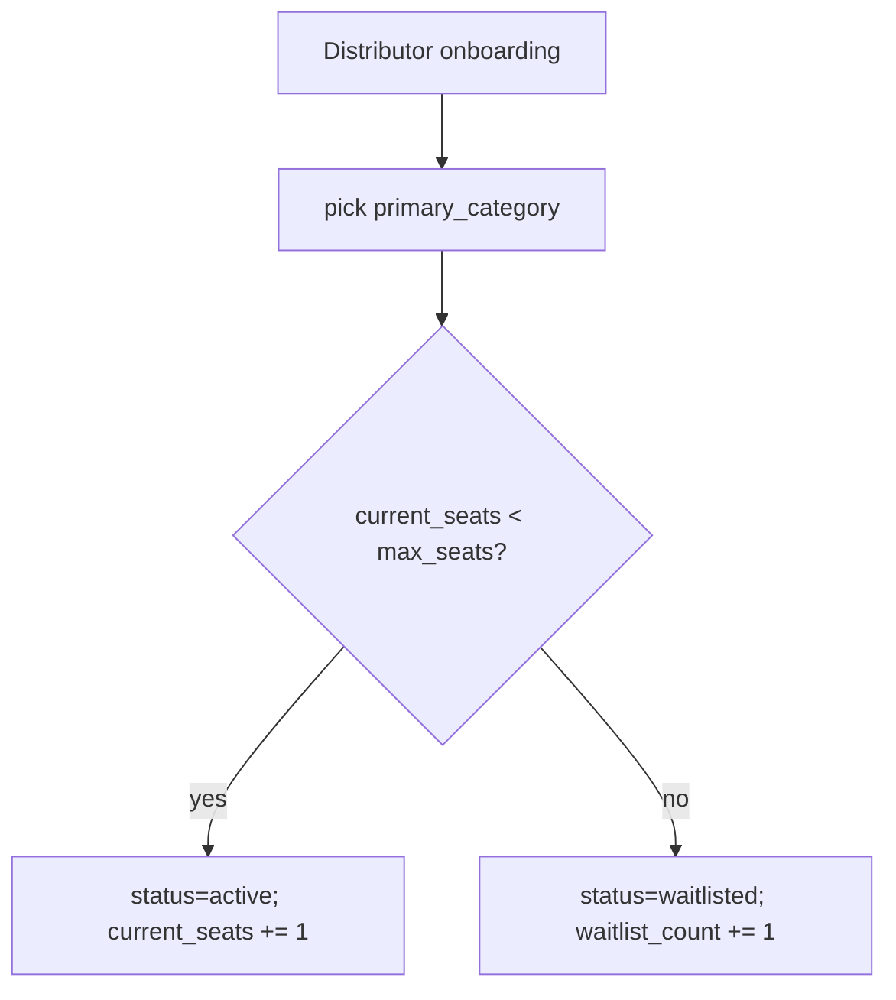
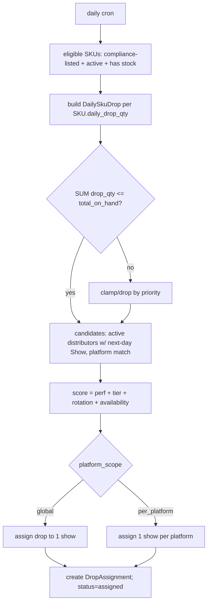
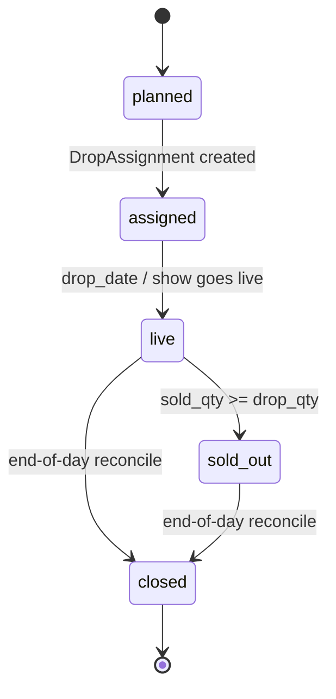
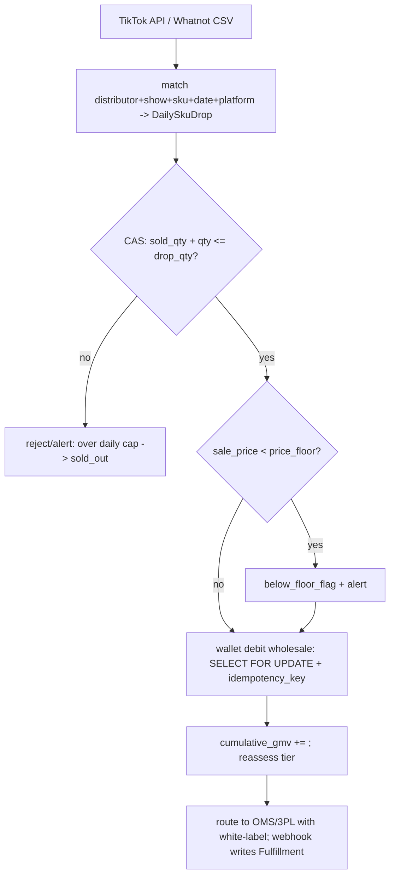

# NewCo Distribution Orchestration — Design (locked baseline)

Scope: a thin orchestration layer above external WMS/OMS/3PL. NewCo is the
upstream supplier + warehouse drop-shipper; distributors are the merchant of
record on their own TikTok Shop / Whatnot accounts. Funds flow through a
pre-funded wallet. Earnings = wholesale spread + own-GMV rebate (no downline).

Allocation core = **daily-drop scheduling** (`DailySkuDrop` + `DropAssignment`).
The earlier per-show `InventoryAllocation` model is removed.

## Boundaries

```
        NewCo Orchestration (this repo)
  distributor • wallet • catalog/compliance • daily-drop engine
  • sales ingest • price-floor • white-label fulfillment routing
            │ Stripe   │ TikTok API  │ Whatnot CSV │ OMS/3PL (Cin7/ShipStation)
```

`SKU.total_on_hand` is a one-way mirror of the OMS inventory feed. NewCo never
writes physical stock; it plans daily exposure on top of the mirror.

## Data model

13 tables: `category_seat`, `distributor`, `wallet_transaction`, `product`,
`sku`, `wholesale_price`, `compliance_record`, `show`, `daily_sku_drop`,
`drop_assignment`, `sales_order`, `fulfillment`, `product_return`.

Key fields per the locked spec live in `app/models/`. Highlights:

- **CategorySeat** `category, max_seats, current_seats, waitlist_count` —
  onboarding scarcity gate.
- **SKU** mandatory compliance/pricing: `hts_code, duty_rate, landed_cost,
  cpsia_status, ca_metals_compliant, prop65_flag, ftc_jewelry_labeled,
  price_floor`; scheduling: `daily_drop_qty, total_on_hand, version`.
- **DailySkuDrop** `sku_id, drop_date, platform_scope(global|per_platform),
  platform(null|tiktok|whatnot), drop_qty, sold_qty, status`.
- **DropAssignment** `daily_sku_drop_id, distributor_id, show_id,
  assigned_at, score_snapshot(jsonb)`.

### Uniqueness & invariants (enforced in DB)

```
daily_sku_drop:
  UNIQUE(sku_id, drop_date, platform_scope) WHERE platform IS NULL      -- global once/day
  UNIQUE(sku_id, drop_date, platform_scope, platform) WHERE platform IS NOT NULL
  CHECK sold_qty <= drop_qty                                            -- oversell guard
  CHECK (scope=global AND platform IS NULL) OR (scope=per_platform AND platform IS NOT NULL)
drop_assignment:
  UNIQUE(daily_sku_drop_id)        -- one assignment per (platform-)drop, both scopes
wallet_transaction:
  UNIQUE(idempotency_key)          -- re-ingest never double-charges
sales_order:
  UNIQUE(source, external_order_id)
```

### Inventory hard constraint (planning time, in a tx)

For each `(sku, drop_date)`:  `SUM(drop_qty) <= SKU.total_on_hand`.
Generation reads `total_on_hand + version`, sums existing planned/assigned/live
drop_qty, validates, then writes. `available_for_drop = total_on_hand −
future_planned_drop_qty` is a derived planning view, not a WMS.

## CategorySeat onboarding



## Daily allocation engine (cron, generates next-day plan)



Scoring (pluggable `AssignmentStrategy`):
```
score = w_perf*recent_sell_through + w_tier*tier_score
      + w_rotation*under_served_score + w_avail*has_show_for_platform
```
Floor rotation: tail distributors who went long without a drop get a rising
`under_served_score`, preventing head monopoly.

## DailySkuDrop state machine



## Sales ingest + oversell + wallet debit



Oversell guard (the new hot path, replaces the old request-time lock):
```sql
UPDATE daily_sku_drop SET sold_qty = sold_qty + :q
 WHERE id = :id AND sold_qty + :q <= drop_qty;   -- rowcount 0 => sold_out
```

## End-of-day reconcile

1. Sum confirmed `SalesOrder.qty` per drop → write back `sold_qty`.
2. Unsold (`drop_qty − sold_qty`) was never physically removed → returns to the
   available pool for future dates.
3. `sold_qty == drop_qty` → sold_out; then closed.
4. Update `distributor.cumulative_gmv` and tier from final GMV.

## Two MVP critical paths

- (a) topup → sample → wholesale unlock → seat check → active/waitlist.
- (b) daily drop → assign to show → ingest → cap + price-floor check → wallet
  wholesale debit → fulfillment routing.

## Anti-pyramid

Earnings = wholesale spread + own-GMV rebate. No `sponsor/upline/downline/
referral/commission` columns anywhere; `tests/test_anti_pyramid.py` enforces it.
